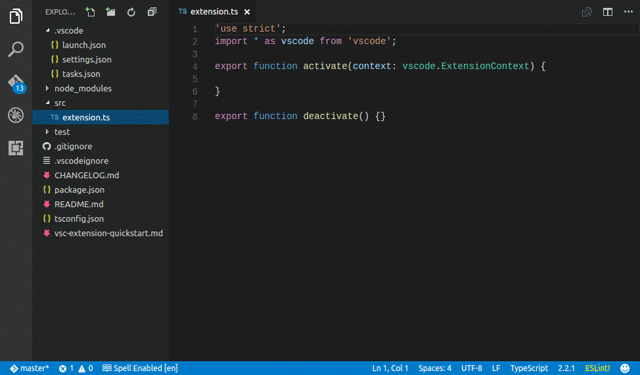

[](https://travis-ci.org/sleistner/vscode-fileutils)
[](https://david-dm.org/sleistner/vscode-fileutils)
[](https://snyk.io/test/github/sleistner/vscode-fileutils) [](https://greenkeeper.io/)
[](https://github.com/semantic-release/semantic-release)

# File Utils - Visual Studio Code Extension

A convenient way of creating, duplicating, moving, renaming, deleting files and directories.

> Inspired by [Sidebar Enhancements](https://github.com/titoBouzout/SideBarEnhancements) for Sublime.


# How to use



## Using the command palette:

* Bring up the command palette, and select "File: ".
* Select one of the commands mentioned below.
* Press [Enter] to confirm, or [Escape] to cancel.


## Note

Nonexistent folders are created automatically.


## Commands

```json
[
    {
        "command": "fileutils.renameFile",
        "category": "File",
        "title": "Rename"
    },
    {
        "command": "fileutils.moveFile",
        "category": "File",
        "title": "Move"
    },
    {
        "command": "fileutils.duplicateFile",
        "category": "File",
        "title": "Duplicate"
    },
    {
        "command": "fileutils.removeFile",
        "category": "File",
        "title": "Delete"
    },
    {
        "command": "fileutils.newFile",
        "category": "File",
        "title": "New File Relative to Current View"
    },
    {
        "command": "fileutils.newFileAtRoot",
        "category": "File",
        "title": "New File Relative to Project Root"
    },
    {
        "command": "fileutils.newFolder",
        "category": "File",
        "title": "New Folder Relative to Current View"
    },
    {
        "command": "fileutils.newFolderAtRoot",
        "category": "File",
        "title": "New Folder Relative to Project Root"
    },
    {
        "command": "fileutils.copyFileName",
        "category": "File",
        "title": "Copy Name Of Active File"
    }
]
```

## Context Menu

```json
{
    "explorer/context": [
        {
            "command": "fileutils.moveFile",
            "group": "edit"
        },
        {
            "command": "fileutils.duplicateFile",
            "group": "edit"
        }
    ],
    "editor/context": [
        {
            "command": "fileutils.moveFile",
            "group": "edit"
        },
        {
            "command": "fileutils.duplicateFile",
            "group": "edit"
        }
    ]
}
```

## Configuration

```json
{
    "fileutils.delete.useTrash": {
        "type": "boolean",
        "default": false,
        "description": "Move file to the recycle bin instead of deleting it permanently."
    },
    "fileutils.delete.confirm": {
        "type": "boolean",
        "default": true,
        "description": "Controls if it should ask for confirmation when deleting a file."
    },
    "fileutils.typeahead.enabled": {
        "type": "boolean",
        "default": true,
        "description": "Controls if directory selector should be shown."
    },
    "fileutils.typeahead.exclude": {
        "type": "object",
        "default": {},
        "description": "Configure glob patterns for excluding files and folders."
    }
}
```

# Changelog

- [https://github.com/sleistner/vscode-fileutils/blob/master/CHANGELOG.md](https://github.com/sleistner/vscode-fileutils/blob/master/CHANGELOG.md)

# How to contribute

1. Download source code and install dependencies
```bash
git clone git@github.com:sleistner/vscode-fileutils.git
cd vscode-fileutils
npm install
code .
```
2. Make the respective code changes.
3. Go to the debugger in VS Code, choose `Launch Extension` and click run. You can test your changes.
4. Choose `Launch Tests` to run the tests.
5. Submit a PR.

**Important:** Release and changleog update are executed as TravisCI job.

Please consider Angular Commit Message Conventions.
* https://github.com/angular/angular.js/blob/master/DEVELOPERS.md#commits
* https://blog.greenkeeper.io/introduction-to-semantic-release-33f73b117c8

# Disclaimer

**Important:** This extension due to the nature of it's purpose will create
files on your hard drive and if necessary create the respective folder structure.
While it should not override any files during this process, I'm not giving any guarantees
or take any responsibility in case of lost data.

# Contributors

* [Steffen Leistner](https://github.com/sleistner)
* [Ilia Shkolyar](https://github.com/iliashkolyar)

# License

MIT
