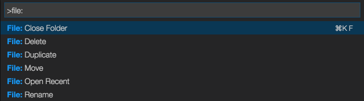

[](https://travis-ci.org/sleistner/vscode-fileutils)
[](https://gemnasium.com/github.com/sleistner/vscode-fileutils)

# Fileutils - Visual Studio Code Extension

A convenient way of creating, moving, renaming, deleting files and directories.

> Inspired by [Sidebar Enhancements](https://github.com/titoBouzout/SideBarEnhancements) for Sublime.

# Usage



## Using the command palette:

* Bring up the command palette, and select "File: ".
* Select one of the commands mentioned below.
* Press [Enter] to confirm, or [Escape] to cancel.

## Commands

```json
[
    {
        "command": "extension.renameFile",
        "title": "File: Rename"
    },
    {
        "command": "extension.moveFile",
        "title": "File: Move"
    },
    {
        "command": "extension.duplicateFile",
        "title": "File: Duplicate"
    },
    {
        "command": "extension.removeFile",
        "title": "File: Delete"
    },
    {
        "command": "extension.newFile",
        "title": "File: New File Relative to Current View"
    },
    {
        "command": "extension.newFileAtRoot",
        "title": "File: New File Relative to Project Root"
    },
    {
        "command": "extension.newFolder",
        "title": "File: New Folder Relative to Current View"
    },
    {
        "command": "extension.newFolderAtRoot",
        "title": "File: New Folder Relative to Project Root"
    }
]
```

# How to contribute

1. Download source code and install dependencies 
```bash
git clone git@github.com:sleistner/vscode-fileutils.git
cd vscode-fileutils
npm install
code .
```
2. Make the respective code changes.
3. Go to the debugger in VS Code, choose `Launch Extension` and click run. You can test your changes.
4. Choose `Launch Tests` to run the tests.
5. Submit a PR.

# Disclaimer

**Important:** This extension due to the nature of it's purpose will create
files on your hard drive and if necessary create the respective folder structure.
While it should not override any files during this process, I'm not giving any guarantees
or take any responsibility in case of lost data. 

# Contributors

[Steffen Leistner](https://github.com/sleistner)

# License

MIT
